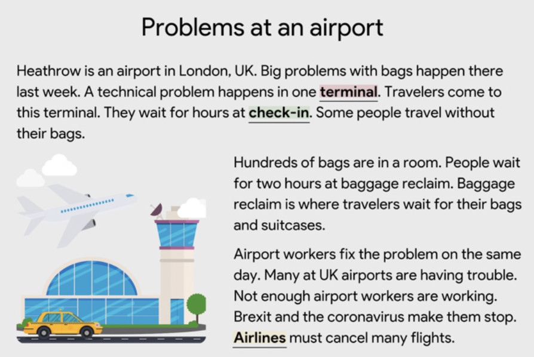
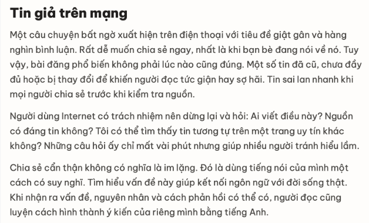
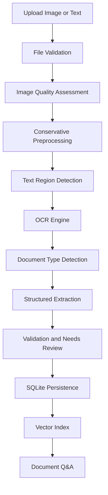
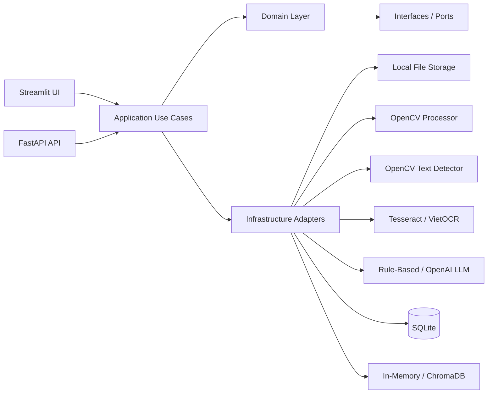

# Vietnamese Document Intelligence System


An end-to-end AI document intelligence system for OCR, structured information extraction, validation, and document question answering. The project is built as a practical portfolio application for AI, Computer Vision, NLP, and LLM internship applications.

The system supports document images, receipt images, Vietnamese text, English text, local rule-based extraction, optional OpenAI extraction, and RAG-style question answering over uploaded documents.

## Demo Results

### English Document OCR



| Metric | Result |
| --- | --- |
| File | `doc/english_document.png` |
| Detected document type | `document` |
| Extracted title | `Problems at an airport` |
| OCR confidence | `0.9558` |
| Observed word errors | `0 / 104` |

OCR output:

```text
Problems at an airport
Heathrow is an airport in London, UK. Big problems with bags happen there
last week. A technical problem happens in one terminal. Travelers come to
this terminal. They wait for hours at check-in. Some people travel without
their bags.
Hundreds of bags are in a room. People wait
for two hours at baggage reclaim. Baggage
reclaim is where travelers wait for their bags
and suitcases.
Airport workers fix the problem on the same
day. Many at UK airports are having trouble.
Not enough airport workers are working.
Brexit and the coronavirus make them stop.
Airlines must cancel many flights.
```

### Vietnamese Document OCR



| Metric | Result |
| --- | --- |
| File | `doc/vietnamese_document.png` |
| Detected document type | `document` |
| Extracted title | `Tin giả trên mạng` |
| OCR confidence | `0.9427` |
| Observed word errors | `19 / 201` |

OCR output:

```text
Tin giả trên mạng
Một câu chuyện bốt ngờ xuết hiện trên điện thoại với tiêu để giật gân và hàng
nghìn bình luận. Rất dễ muốn chia sẻ ngay, nhất là khi bạn bè dang nói về nó. Tuy
vay, bài đăng phổ biến không phải lúc nào cũng đúng. Một số tin đỡ cũ, chưa đầy
đủ hoặc bị thay đổi để khiến người đọc tức gidn hay sợ hãi. Tin sai lan nhanh khi
mọi người chia sẻ trước khi kiểm tra nguồn.
Người dùng Internet có trách nhiệm nên dừng lợi va hỏi: Ai viết điều này? Nguồn
có đáng tin không? Tôi có thể tìm thấy tin tương tự trên một trang uy tín khác.
không? Những côu hỏi ấy chỉ mết vai phút nhưng giúp nhiều người tránh hiểu lầm.
Chia sẻ cẩn than không có nghĩa lò im lặng. Đó là dùng tiếng nói của mình một
cách có suy nghĩ. Tìm hiểu vến dé này giúp kết nối ngôn ngữ với đời sống that.
Khi nhộn ra van đề, nguyên nhân và cách phản hồi có thể có, người đọc cũng
luyện cách hình thành ý kiến của riêng mình bằng tiếng Anh.
```

Vietnamese OCR is more challenging because diacritics are small visual marks. The system can read the main content, but post-processing or a Vietnamese-first OCR model is recommended when character-level accuracy is required.

Common Vietnamese OCR errors observed:

| Ground truth | OCR |
| --- | --- |
| `bất` | `bốt` |
| `xuất` | `xuết` |
| `đề` | `để` |
| `đang` | `dang` |
| `vậy` | `vay` |
| `giận` | `gidn` |
| `câu` | `côu` |
| `vấn đề` | `vến dé` |
| `thật` | `that` |

## What This Project Demonstrates

- Computer Vision pipeline for image quality analysis, preprocessing, text region detection, and OCR.
- NLP pipeline for raw OCR normalization, structured extraction, and validation.
- RAG-style document question answering over OCR text.
- Clean Architecture and SOLID principles with replaceable infrastructure adapters.
- Practical handling of real OCR failure modes: rotated receipts, bright screenshots, Vietnamese diacritics, noisy receipt layouts, and uncertain extractions.
- Testable application design with FastAPI, Streamlit, SQLite, and vector store abstractions.

## Pipeline



## Architecture



The application layer depends on interfaces such as `OcrEngine`, `LlmEngine`, `VectorStore`, `ImageProcessor`, `TextDetector`, and `DocumentRepository`. Infrastructure tools can be replaced without changing the core business workflow.

## Project Structure

```text
src/
  domain/
    entities/          Core business entities
    services/          Interfaces / ports
    repositories/      Repository contracts
  application/
    use_cases/         Processing and Q&A workflows
    dto/               Response models
  infrastructure/
    database/          SQLite repository
    image_processing/  OpenCV quality checks and preprocessing
    llm/               Rule-based and OpenAI extraction engines
    ocr/               Tesseract, plain text, and VietOCR adapters
    storage/           Local file storage
    text_detection/    OpenCV text region detection
    vector_store/      In-memory and ChromaDB retrieval
  presentation/
    api/               FastAPI routes
    ui/                Streamlit demo application
  shared/              Config and custom exceptions
tests/                 Pytest coverage
samples/               Small safe demo samples
doc/                   README images and visual documentation
scripts/               Utility scripts
```

## Tech Stack

| Area | Tools |
| --- | --- |
| Language | Python 3.12+ |
| API | FastAPI, Pydantic |
| UI | Streamlit |
| Computer Vision | OpenCV |
| OCR | Tesseract, VietOCR adapter |
| LLM | Rule-based fallback, optional OpenAI SDK |
| RAG | In-memory retrieval, optional ChromaDB |
| Storage | SQLite, local filesystem |
| Testing | Pytest |

## Getting Started

### 1. Create Environment

```bash
python -m venv .venv
source .venv/bin/activate
pip install -r requirements.txt
```

### 2. Install Tesseract

macOS:

```bash
brew install tesseract tesseract-lang
```

Verify Vietnamese language support:

```bash
tesseract --list-langs | grep vie
```

### 3. Configure Environment

```bash
cp .env.example .env
```

The project can run locally without an API key through the rule-based fallback. Add an OpenAI API key only if you want to use the optional LLM adapter.

## Run The Application

### Streamlit Demo UI

```bash
streamlit run src/presentation/ui/streamlit_app.py --server.port 8501
```

Open:

```text
http://localhost:8501
```

### FastAPI

```bash
uvicorn src.presentation.api.main:app --reload --port 8000
```

Open:

```text
http://127.0.0.1:8000/docs
```

## API Overview

### Health Check

```http
GET /health
```

### Process Document

```http
POST /documents
```

Multipart field:

```text
file
```

### Get Document Result

```http
GET /documents/{document_id}
```

### Ask About A Document

```http
POST /documents/{document_id}/questions
```

Example request:

```json
{
  "question": "What is the document title?"
}
```

## Test

```bash
pytest
```

Current covered areas:

- Main document processing pipeline.
- Rule-based extraction and Q&A behavior.
- Chroma vector store integration.

## Notes On Data And GitHub

Runtime files are intentionally ignored by Git:

```text
data/
.venv/
*.db
__pycache__/
.pytest_cache/
```

Only lightweight, safe demo assets are kept in `samples/` and `doc/`.

## Roadmap

- Add Vietnamese OCR post-processing with dictionary-based spell correction.
- Add quantitative CER/WER evaluation scripts for OCR datasets.
- Add more robust layout analysis for tables and multi-column receipts.
- Add model selection between Tesseract, VietOCR, and PaddleOCR.
- Add optional OpenAI-based structured extraction with source-grounded JSON.

## License

This project is intended for educational and portfolio use. Add a license file before publishing if you want others to reuse the code formally.
